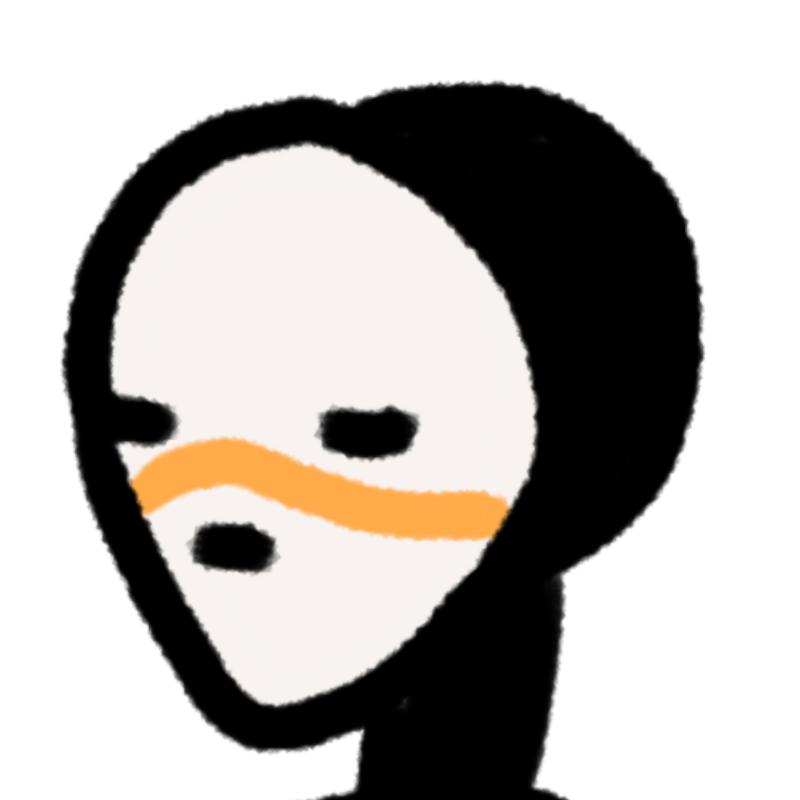
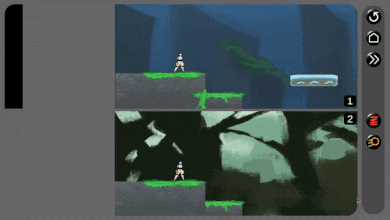
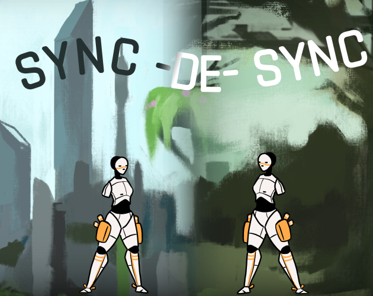

<!-- PROJECT SHIELDS -->
<!--
*** I'm using markdown "reference style" links for readability.
*** Reference links are enclosed in brackets [ ] instead of parentheses ( ).
*** See the bottom of this document for the declaration of the reference variables
*** for contributors-url, forks-url, etc. This is an optional, concise syntax you may use.
*** https://www.markdownguide.org/basic-syntax/#reference-style-links
-->

<!-- PROJECT LOGO -->
 

  

  <h3 align="center">Sync-De-Sync</h3>

  

    A rift in space-time has split Android Neveu into two parallel words. Fortunately for her, she is connected with her <i>alternates</i> in quantum entanglement. Use her powers to sync and desync herself utilizing each <i>alternates'</i> special abilities and help each other traverse unique parallel entangled worlds.
     
    <a href="https://itch.io/jam/gmtk-2021/rate/1078608"><strong>Play the Game »</strong></a>
     
     
  

  

 
 

<!-- TABLE OF CONTENTS -->

  
<h2 style="display: inline-block">Table of Contents</h2>

  <ol>
    <li>
      <a href="#about-the-project">About The Project</a>
      <ul>
        <li><a href="#built-with">Built With</a></li>
      </ul>
    </li>
    <li><a href="#credits">Credits</a></li>
    <li><a href="#acknowledgements">Acknowledgements</a></li>
    <li><a href="#play-the-game">Play the Game</a></li>
  </ol>

<!-- ABOUT THE PROJECT -->
## About The Project

  

  Sync-De-Sync is a puzzle platformer that was made in 48 hours for the 
  <a href="https://itch.io/jam/gmtk-2021">
    GTMK 2021 Game Jam
  </a>

### Built With

* [Unity](https://unity.com)
* [C#](https://docs.microsoft.com/en-us/dotnet/csharp)

<!-- CREDITS -->
## Credits

* beanc16 - [Twitter](https://twitter.com/shocking_shots) - [itch.io](https://shockingshots.itch.io) - [GitHub](https://github.com/beanc16)
  * Team Lead
  * Programming
  * Level Design
  * UI Design

* Kevin Jeong - [itch.io](https://kjeong0.itch.io)
  * Programming
  * Level Design

* Philip (Silevran) - [itch.io](https://silevran.itch.io)
  * Programming
  * Level Design

* Sara Bustamante - [Behance](https://www.behance.net/sarambustama)
    * Assistant Team Lead
    * Marketing Specialist
    * UI Design

* Jonathan Michiemo - [Twitter](https://twitter.com/JonaCapt)
  * Art
  * Animation

* Henry - [Instagram](https://www.instagram.com/ctrlaltpaint)
  * Art

* Chansu Music - [Soundcloud](https://soundcloud.com/not_chance)
  * Music

* Charles Kieswetter - [Twitter](https://twitter.com/charleswkeys)
  * SFX

Project Link: [https://github.com/beanc16/gmtk-2021-penumbrito](https://github.com/github_username/repo_name)

<!-- ACKNOWLEDGEMENTS -->
## Acknowledgements

<!-- Add plugins and dependencies here -->
* [Img Shields](https://shields.io)
* [Universal Render Pipeline](https://docs.unity3d.com/Packages/com.unity.render-pipelines.universal@12.0/manual/index.html)

<!-- Play the Game -->
## Play the Game
 

  <a href="https://itch.io/jam/gmtk-2021/rate/1078608" style="font-size: 36px;">
    <strong>
      Play »
    </strong>
  </a>

<!-- MARKDOWN LINKS & IMAGES -->
<!-- https://www.markdownguide.org/basic-syntax/#reference-style-links -->

<!-- Custom -->
<!-- Add any custom links or images here -->

<!-- Default -->
[contributors-shield]: https://img.shields.io/github/contributors/github_username/repo.svg?style=for-the-badge
[contributors-url]: https://github.com/github_username/repo/graphs/contributors
[forks-shield]: https://img.shields.io/github/forks/github_username/repo.svg?style=for-the-badge
[forks-url]: https://github.com/github_username/repo/network/members
[stars-shield]: https://img.shields.io/github/stars/github_username/repo.svg?style=for-the-badge
[stars-url]: https://github.com/github_username/repo/stargazers
[issues-shield]: https://img.shields.io/github/issues/github_username/repo.svg?style=for-the-badge
[issues-url]: https://github.com/github_username/repo/issues
[license-shield]: https://img.shields.io/github/license/github_username/repo.svg?style=for-the-badge
[license-url]: https://github.com/github_username/repo/blob/master/LICENSE.txt
[linkedin-shield]: https://img.shields.io/badge/-LinkedIn-black.svg?style=for-the-badge&logo=linkedin&colorB=555
[linkedin-url]: https://linkedin.com/in/github_username
